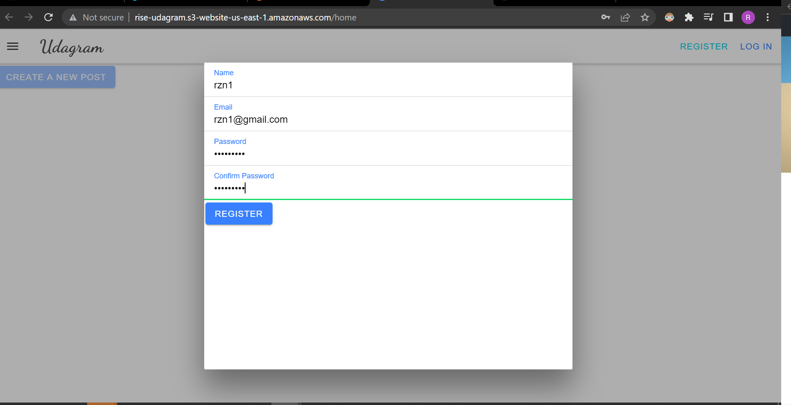
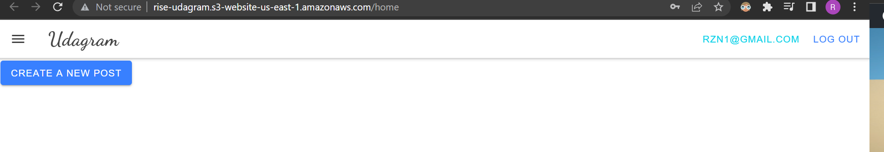
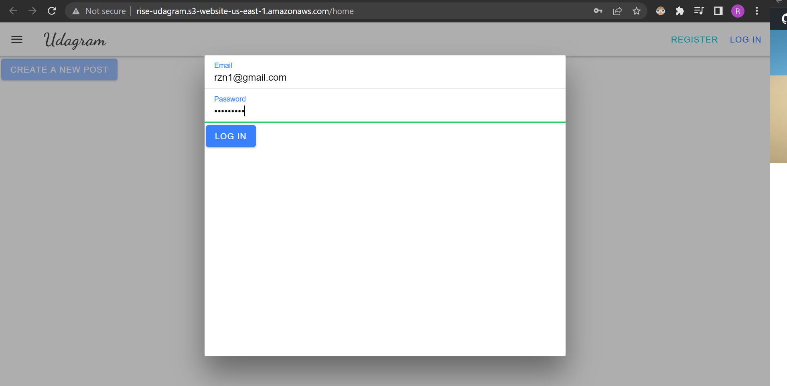

# Hosting a Full-Stack Application (Udagram)

### **We use [ Udagram app](https://github.com/udacity/nd0067-c4-deployment-process-project-starter) a Full-Stack web application that provided from Udacity as a starter code in order to implement the deployment process.**

### Configure infrastructure for a web application
Can be found in [infrastructure documentation](./documentation/InfrastructureDescription.md)
### Project pipeline 
Can be found in [pipeline process documentation](./documentation/PipelineProcess.md)
### Frondend page as follow:

