### Configure infrastructure for a web application
**Here is a high level diagram for AWS cloud infrastructure and services** 
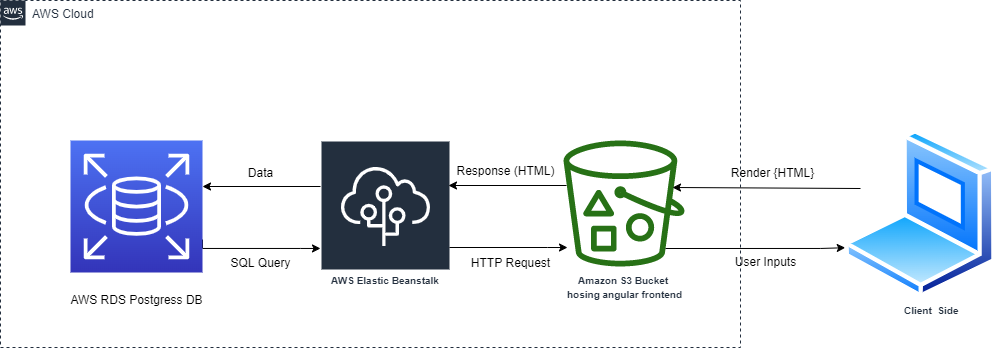

####  * AWS RDS

* Crete remote DB for the deployment and connect it with **the API** then create security groups and edit the inbound rules for PostgreSQL.
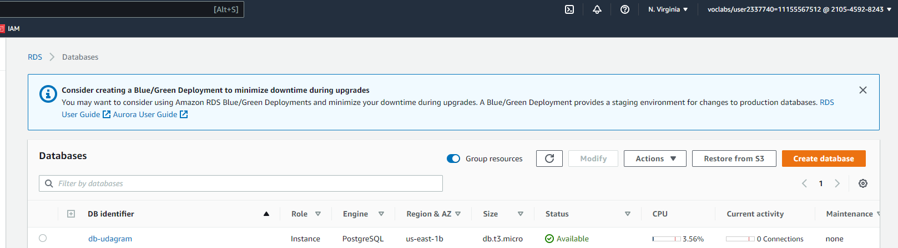
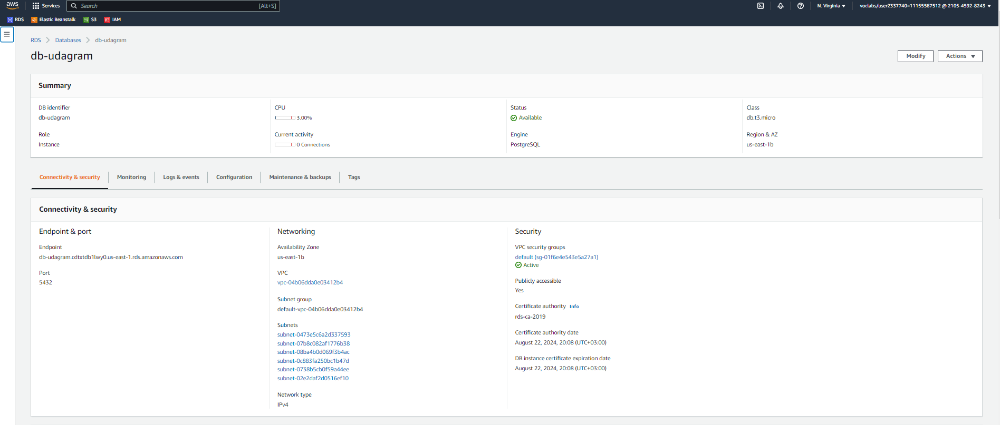
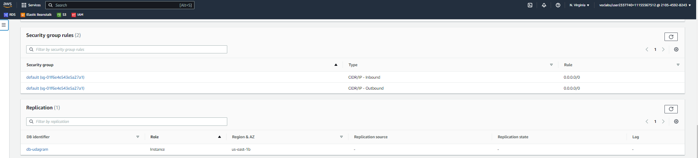
* Test DB connection
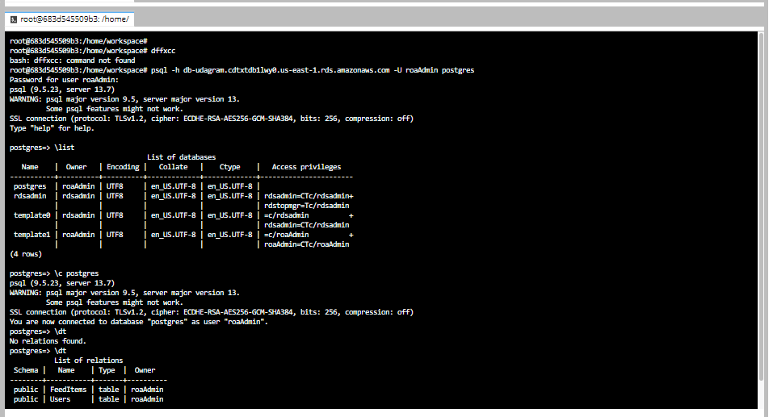
####  * AWS EB

* Initialize **EB** environment for the Backend project application (**API**) using `eb init --platform node.js-14 --region us-east-1` then create the environment remotely using `eb create --sample udagram-api-dev` then use this environment  with `eb use udagram-api-dev`.
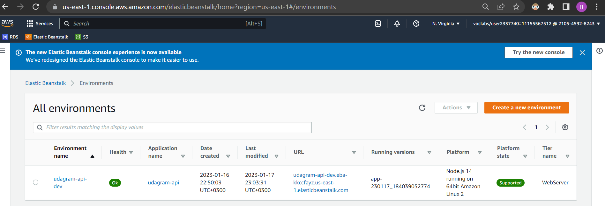
*  Set environment variables using `eb setenv`
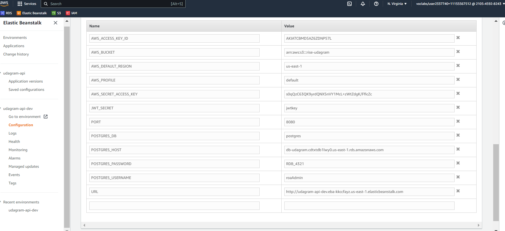
*  After deploying the app on **EB** ,  then the URL for **API**will display `http://udagram-api-dev.eba-fmdi6xaa.us-east-1.elasticbeanstalk.com/`
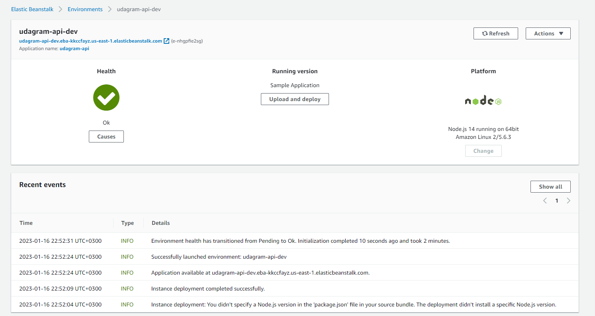
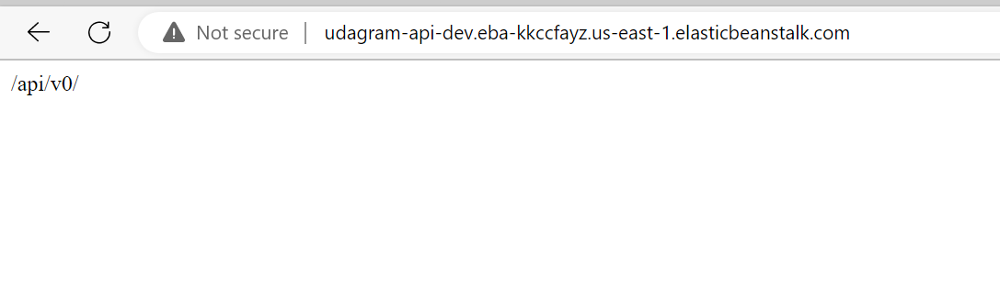
####  * AWS S3

* Create S3 bucket to deploy **Frontend** with`aws s3api create-bucket --bucket rise-udagram --region us-east-1.
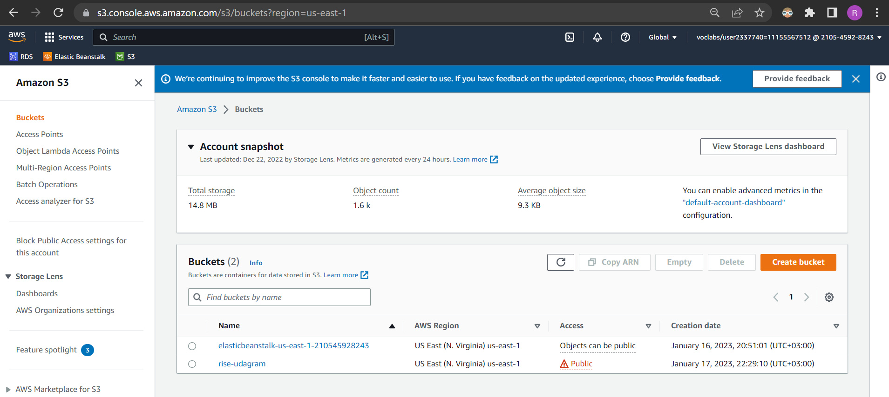
* Build **Frontend** then deploy to **S3** bucket with `aws s3 cp --recursive --acl public-read ./www s3://rise-udagram`
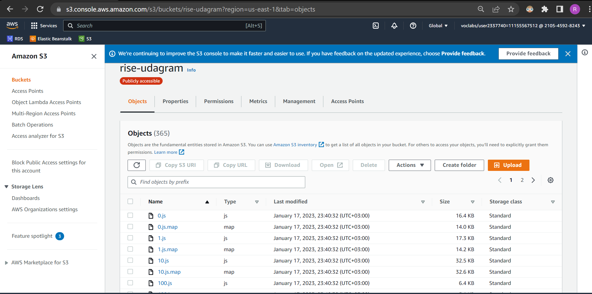