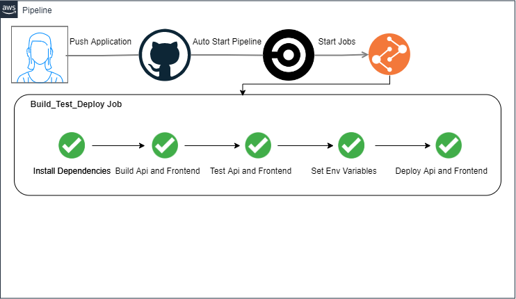
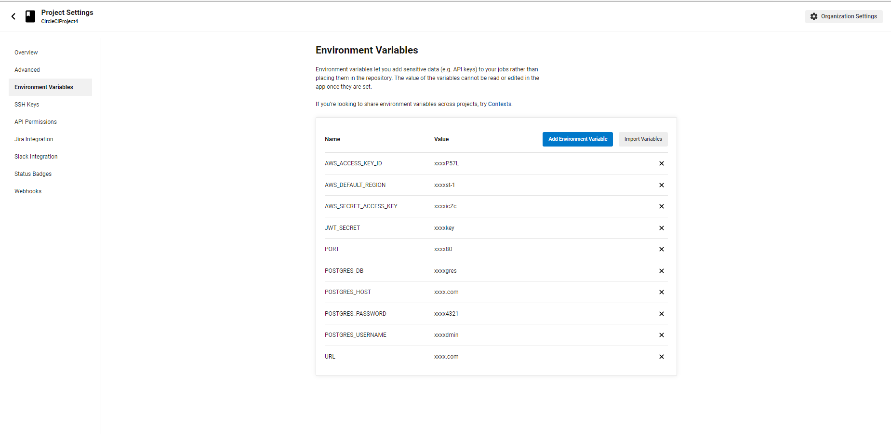
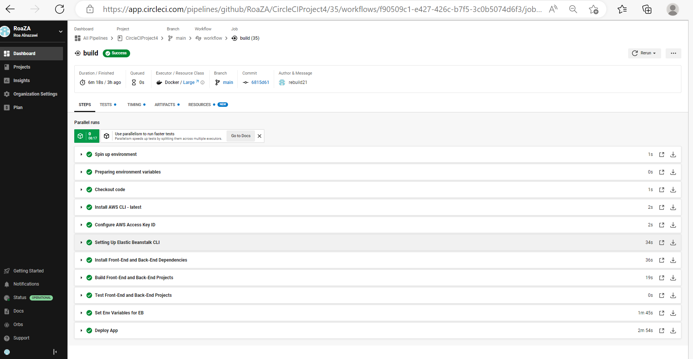
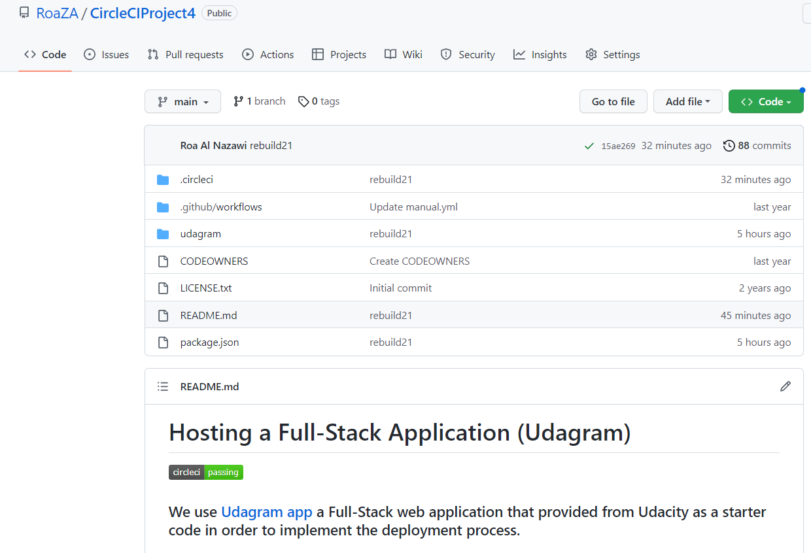

#### CIrcleCI
**Here is an overview pipeline diagram** 

We push the application first to the github, then the process is auto started 
1. Configure AWS Acces Key ID
2. Setting up EB CLI
3. Install all dependencies for API and Frontend projects
4. Build both API and Frontend projects
5. Test both API and Frontend projects
6. Deploy both API and Frontend projects

**All the variables found in the application are configured inside CircleCi project setting**

